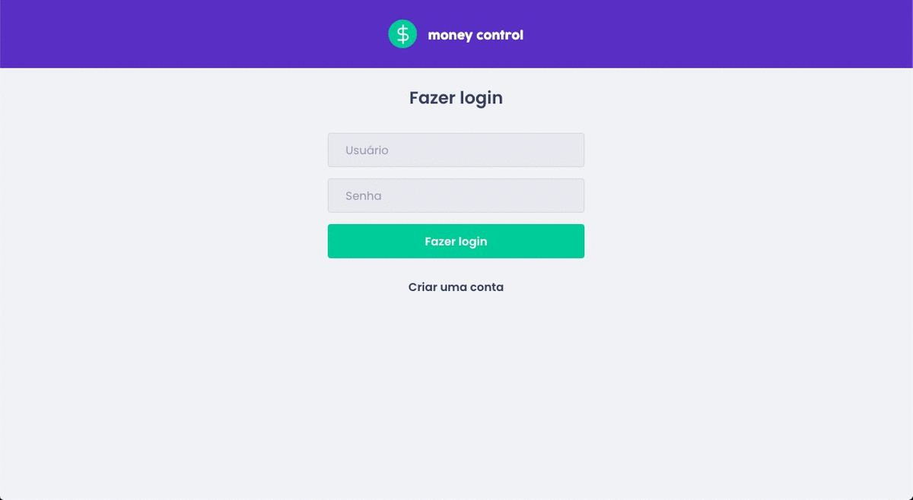

# Money Control



## Start project

```bash
$ yarn
$ yarn start
```

Runs the app in the development mode.\
Open [http://localhost:3000](http://localhost:3000) to view it in the browser.

## Login

**User:** admin

**Password:** admin

# Ready to go!
